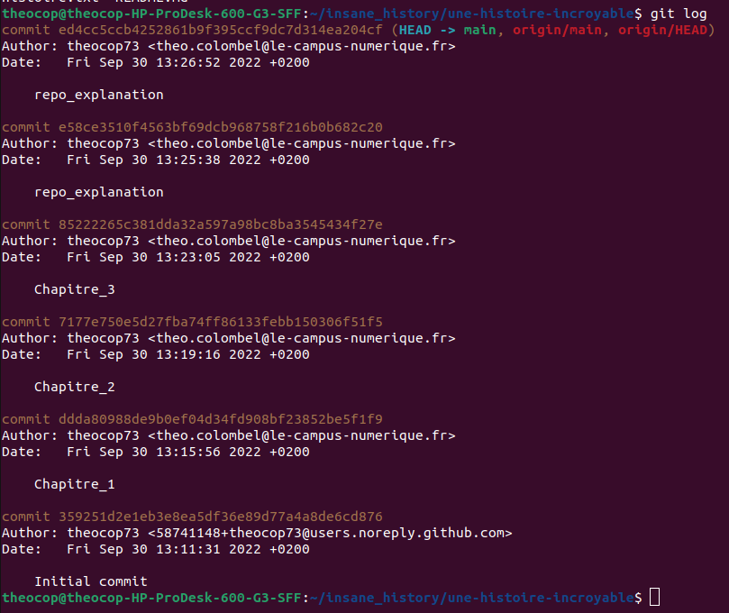

Voici ma preuve de travail pour l'exercice 1.5 :
Consigne 1:

Consigne 2 :
 imaginons que je veux repasser du chapitre 3 au 2 je peux revert mon commit "Chapitre_3" avec git revert 8522
 le chapitre 3 de mon histoire à était supprimmer 

je peux revert mon revert afin de remmetre le chapitre 3 à sa place.
